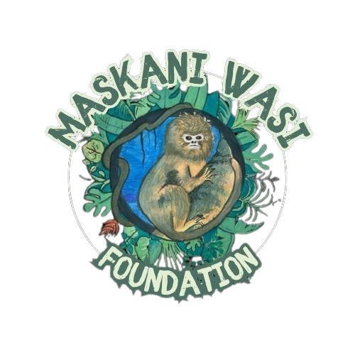

# Maskani Wasi Foundation



## 🌱 ¿Qué es Maskani Wasi?

Maskani Wasi Foundation es un proyecto amazónico que integra la protección del bosque y la riqueza cultural de la región. Promovemos la conservación y el desarrollo comunitario en armonía con la naturaleza.

### Misión
Sembrar hoy un futuro sostenible, respondiendo a los desafíos socioambientales de la Amazonía.

---

## 🚀 Tecnologías principales
- Vite
- React + TypeScript
- Tailwind CSS
- shadcn-ui

---

## 🛠️ Instalación y uso

```sh
# Clona el repositorio
https://github.com/KernyMC/MaskaniWasi.git

cd MaskaniWasi
npm install
npm run dev
```

---

## 🤝 Contribuir
¡Las contribuciones son bienvenidas! Haz un fork, crea una rama y envía tu pull request.

---

## 🌍 Más información
Para conocer más, visita nuestra web o contáctanos.
